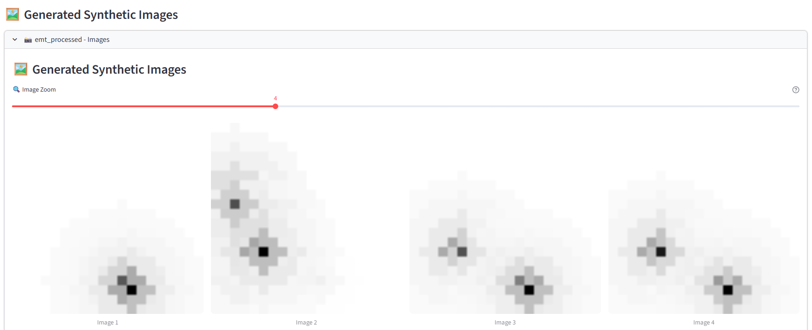

# INESData Dataspace: AI-Powered Data Services with Policy-Compliant Data Exchange

[](https://github.com/INESData)
[](https://www.python.org/downloads/)
[](https://streamlit.io/)
[](https://github.com/oeg-upm/TINTOlib)
[](https://github.com/eclipse-edc/connector)

A comprehensive demonstration of building **data services integrated with an INESData dataspace** using the **EMT (Estación de Monitoreo de Tráfico) dataset** as a real-world example. This project showcases how to create intelligent services that automatically consume policy-compliant data from a distributed dataspace.

## 🎯 Overview

This repository demonstrates a **complete dataspace-driven service architecture** with:
- **Data Service Pattern**: A Streamlit application acting as a dataspace-connected service that consumes data through connectors
- **Policy-Compliant Data Access**: Automatic authentication, contract negotiation, and data transfer respecting dataspace policies
- **Real-World EMT Dataset**: Using EMT traffic monitoring data generated via [inesdata-mov-data-generation](https://github.com/INESData/inesdata-mov-data-generation)
- **AI/ML Integration**: TINTOlib transforms tabular EMT data into synthetic images for computer vision models
- **Connector-Based Integration**: Provider and Consumer EDC connectors managing secure data exchange
- **Automated Workflows**: End-to-end pipelines from data discovery → policy evaluation → transfer → processing

## 🏗️ Architecture: Data Service Connected to Dataspace

```
┌────────────────────────────────────────────────────────────────────┐
│                      INESData Dataspace                             │
├──────────────┬────────────────────────┬─────────────────────────────┤
│  Provider    │   Central Authority    │   Consumer Connector        │
│  Connector   │   (Keycloak, Catalog)  │   (Our Service Access)      │
├──────────────┴────────────────────────┴─────────────────────────────┤
│                                                                      │
│  ┌──────────────────────────────────────────────────────────────┐  │
│  │           Policy Framework (Contract Negotiation)            │  │
│  │  • Usage policies • Data sovereignty • Access control        │  │
│  └──────────────────────────────────────────────────────────────┘  │
│                                                                      │
└──────────────────────────────────────────────────────────────────────┘
                                 │
                                 │ (Policy-compliant data exchange)
                                 │
                    ┌────────────▼────────────┐
                    │  Streamlit Data Service │
                    │  (Consumer Application) │
                    └────────────┬────────────┘
                                 │
                 ┌───────────────┬┴─────────────────┐
                 │               │                 │
        ┌────────▼────────┐ ┌───▼─────┐ ┌────────▼────────┐
        │  EMT Data from  │ │ Contract │ │  TINTOlib AI    │
        │  Dataspace      │ │ Manager  │ │  Synthesizer    │
        │  (via Connector)│ │          │ │  (Vision Models)│
        └─────────────────┘ └──────────┘ └─────────────────┘
```

**Key Innovation**: This example demonstrates how to build **intelligent services that are consumers within a dataspace**, automatically discovering, negotiating, and accessing policy-compliant data without manual intervention.

## 📦 Components

This project integrates the following INESData components:

| Component | Repository | Description |
|-----------|-----------|-------------|
| **Connector** | [inesdata-connector](https://github.com/INESData/inesdata-connector) | Core EDC-based connector for data exchange |
| **Deployment** | [inesdata-deployment](https://github.com/INESData/inesdata-deployment) | Infrastructure deployment scripts and configurations |
| **Public Portal Frontend** | [inesdata-public-portal-frontend](https://github.com/INESData/inesdata-public-portal-frontend) | Web interface for dataspace exploration |
| **Public Portal Backend** | [inesdata-public-portal-backend](https://github.com/INESData/inesdata-public-portal-backend) | Backend services for portal functionality |
| **Registration Service** | [inesdata-registration-service](https://github.com/INESData/inesdata-registration-service) | Connector registration and management |

## 💡 Use Case: EMT Traffic Data → AI Vision Models

This project uses **EMT (Estación de Monitoreo de Tráfico) traffic monitoring data** as a real-world example of how organizations can:

1. **Share data through dataspaces** while maintaining control via policies
2. **Build intelligent services** that automatically consume policy-compliant data
3. **Add value** through AI/ML transformations (synthetic image generation)
4. **Monetize or collaborate** using dataspace frameworks

### The EMT Dataset

### Step 1: Data Generation (EMT Dataset)
The workflow starts with **EMT traffic monitoring data** generated using [inesdata-mov-data-generation](https://github.com/INESData/inesdata-mov-data-generation). This dataset is exposed through the **Provider Connector** within the dataspace.

**Key Point**: Any data provider can expose their datasets following dataspace standards and policies.

### Step 2: Authentication & Authorization
Secure login via Keycloak using consumer connector credentials. The app manages OAuth2 tokens for all dataspace interactions. This ensures only authorized services can access data.


### Step 3: Federated Catalog Discovery
Browse the **federated catalog** to discover available datasets exposed by any Provider Connector. The service automatically discovers the EMT dataset and other available resources.


**Pattern**: This demonstrates how services can **automatically discover and catalog available data** without manual configuration.

### Step 4: Policy-Aware Contract Negotiation
View detailed metadata and **automatically negotiate usage contracts**. The system evaluates data access policies:
- Who can access the data?
- How can the data be used?
- What processing is allowed?
- Are there time/usage restrictions?

The contract is negotiated programmatically before access is granted.


**Innovation**: Policies are evaluated automatically, enabling services to **respect data sovereignty** without manual approval workflows.

### Step 5: Secure Policy-Compliant Data Transfer
Once the contract is agreed upon, the **EMT dataset (CSV) is securely transferred via EDC protocols**. The system ensures:
- Only authorized services receive the data
- Transfer is encrypted and traceable
- Access is logged and auditable
- Policies continue to apply to the received data


### Step 6: AI-Powered Data Processing with TINTOlib
The tabular EMT data is processed using **TINTOlib** to generate synthetic images. This demonstrates **adding value through AI while respecting data policies**:

- **Input**: Tabular EMT traffic metrics (vehicle counts, speeds, congestion patterns, etc.)
- **Process**: TINTOlib converts features to synthetic images representing the feature space
- **Output**: High-dimensional images ready for CNNs, Vision Transformers, or other deep learning models


### Step 7: Generated Vision Dataset Ready for ML
The synthetic images represent the complete feature space of the EMT data, enabling training of computer vision models.



**Business Value**: Organizations can:
- Train vision models on private data without sharing raw records
- Create new data products (synthetic images) from shared data
- Maintain compliance with data policies throughout the process
- Build AI services that rely on dataspace-sourced data

---

---

## 🔧 Building Data Services Connected to Dataspaces: The Pattern

This project exemplifies a **reusable service architecture pattern** for dataspace-integrated applications. Here's how to build similar services:

### Service Integration Pattern

```python
# Your Data Service Architecture
┌─────────────────────────────────────────────────────────────┐
│         Your Intelligent Data Service                        │
├─────────────────────────────────────────────────────────────┤
│                                                               │
│  1. Service Bootstrap & Config                               │
│     └─ Initialize consumer connector credentials             │
│     └─ Load dataspace catalog endpoint                       │
│                                                               │
│  2. Data Discovery Module                                    │
│     └─ Query federated catalog (async)                       │
│     └─ Filter datasets by metadata/domain                    │
│     └─ Parse available contracts & policies                  │
│                                                               │
│  3. Policy Evaluation Engine                                 │
│     └─ Check data access policies automatically              │
│     └─ Verify service compliance requirements                │
│     └─ Negotiate contracts programmatically                  │
│                                                               │
│  4. Secure Data Ingestion                                    │
│     └─ Request data via EDC consumer connector               │
│     └─ Manage transfer tokens & encryption                   │
│     └─ Validate received data integrity                      │
│                                                               │
│  5. Business Logic & AI Processing                           │
│     └─ Apply your domain logic (TINTOlib in this example)    │
│     └─ Add value while respecting data policies              │
│     └─ Generate insights/products from dataspace data        │
│                                                               │
│  6. Result Management                                        │
│     └─ Store processed outputs                               │
│     └─ Optionally expose new datasets to dataspace           │
│     └─ Maintain audit trail of data usage                    │
│                                                               │
└─────────────────────────────────────────────────────────────┘
```

### Key Capabilities Your Service Gains

| Capability | Benefit |
|-----------|---------|
| **Automatic Data Discovery** | Services find new data sources without reconfiguration |
| **Policy Compliance** | Access control is automatic, not manual |
| **Secure Exchange** | EDC handles encryption, authentication, and audit logs |
| **Scalability** | Add more data providers/consumers transparently |
| **Interoperability** | Works with any dataspace using EDC standards |
| **Trust & Governance** | Data sovereignty maintained throughout pipeline |

### Real-World Example: This Project

This repository implements exactly this pattern:
- **Service**: Streamlit application acts as consumer service
- **Discovery**: Queries catalog for EMT datasets
- **Data Transfer**: Securely receives CSV from provider
- **Processing**: Applies TINTOlib transformation
- **Output**: Generates and manages synthetic images

---

## 🚀 Quick Start

### Prerequisites

- **Kubernetes cluster** (Minikube recommended for local deployment)
- **Docker** with Minikube tunnel running
- **kubectl** and **helm** installed
- **Python 3.10+**

### 📘 Deployment Guides

This repository includes comprehensive documentation for local deployment:

- **📄 [Instalar-Inesdata-DEV-localmente-v2.pdf](./Instalar-Inesdata-DEV-localmente-v2.pdf)** - Complete step-by-step guide for local INESData deployment (Spanish)
- **📝 [deployment-guide.txt](./inesdata-deployment/deployment-guide.txt)** - Quick reference with deployment commands
- **📋 [Guia_Despliegue_Local_INESData.docx](./Guia_Despliegue_Local_INESData.docx)** - Local deployment documentation (Spanish)
- **📋 [INESData_MOV_Guide.docx](./INESData_MOV_Guide.docx)** - INESData Mobile data generation guide

### Deployment Steps

For detailed step-by-step instructions, refer to the comprehensive deployment guides:

- **[Instalar-Inesdata-DEV-localmente-v2.pdf](./Instalar-Inesdata-DEV-localmente-v2.pdf)** - Complete local deployment walkthrough with all prerequisites and configurations
- **[Guia_Despliegue_Local_INESData.docx](./Guia_Despliegue_Local_INESData.docx)** - Additional deployment notes and troubleshooting

#### Quick Reference Commands

1. **Deploy common services** (PostgreSQL, MinIO, Keycloak, Vault)
   ```bash
   cd inesdata-deployment/common
   helm install -f values.yaml -n common --create-namespace common-services .
   ```

2. **Create dataspace and connectors**
   ```bash
   cd inesdata-deployment
   source .venv/bin/activate
   python deployer.py dataspace create <dataspace-name>
   python deployer.py connector create <connector-provider> <dataspace-name>
   python deployer.py connector create <connector-consumer> <dataspace-name>
   ```

3. **Deploy using Helm charts** (follow detailed steps in PDF guide)
   ```bash
   # Deploy registration service (step 1)
   cd dataspace/step-1
   helm install -f values.yaml -n <dataspace-name>-ds --create-namespace <dataspace-name>-dataspace-s1 .
   
   # Deploy connectors
   cd ../../connector
   helm install -f values.yaml -n <dataspace-name>-ds <connector-name> .
   ```

4. **Launch Streamlit application**
   ```bash
   cd streamlit-dataspace-app
   pip install -r requirements.txt
   streamlit run app.py
   ```

### 🐳 Using Local Docker Images

Instead of pulling images from GitHub Container Registry (`ghcr.io/inesdata/*`), you can build and use local images:

1. **Build images locally** for each component:
   ```bash
   # Build connector image
   cd inesdata-connector
   docker build -f docker/Dockerfile -t inesdata-connector:local .
   
   # Build connector interface
   cd ../inesdata-connector-interface
   docker build -f docker/Dockerfile -t inesdata-connector-interface:local .
   
   # Build registration service
   cd ../inesdata-registration-service
   docker build -f docker/Dockerfile -t inesdata-registration-service:local .
   
   # Build public portal frontend
   cd ../inesdata-public-portal-frontend
   docker build -f docker/Dockerfile -t inesdata-public-portal-frontend:local .
   ```

2. **Update Helm values** to use local images:
   - In `inesdata-deployment/connector/values.yaml.tpl`, change:
     ```yaml
     image:
       name: inesdata-connector:local
       pullPolicy: Never
     ```
   - Apply similar changes to other component values files
   
   > See deployment guides for complete instructions on local image configuration

## 💡 Use Case: EMT Traffic Data → AI Vision Models

The Streamlit application demonstrates an AI workflow using real EMT traffic data:

1. **Authenticate** with Keycloak using consumer connector credentials
2. **Browse** the federated catalog to discover available datasets
3. **Negotiate** contracts automatically with the provider
4. **Transfer** and download tabular datasets (CSV) with policy compliance
5. **Transform** data using TINTOlib into synthetic images
6. **Generate** vision-ready datasets for CNN/transformer models

### TINTOlib Integration

[TINTOlib](https://github.com/oeg-upm/TINTOlib) converts tabular data into images using various methods:
- **TINTO**: Feature-to-pixel mapping
- **IGTD**: Image Generator from Tabular Data
- **BarGraph**: Visual bar representations
- **DistanceMatrix**: Similarity-based visualizations
- And more...

This enables the use of powerful computer vision models (ResNet, Vision Transformers, etc.) on traditionally tabular datasets.

## 📚 How to Build Your Own Dataspace-Connected Service

This project serves as a **template** for building intelligent services that integrate with dataspaces. Here's how to adapt it for your domain:

### Step 1: Set Up Dataspace Access
1. **Configure connector credentials** in your service configuration
2. **Implement authentication** using Keycloak or your identity provider
3. **Initialize the EDC Management API client** to interact with the consumer connector

### Step 2: Implement Data Discovery
```python
async def discover_relevant_data(domain: str) -> List[Dataset]:
    """Query catalog for datasets in your domain"""
    catalog = await connector.query_catalog(
        filters={"domain": domain}
    )
    return [d for d in catalog if meets_your_criteria(d)]
```

**Options**:
- Filter by dataset metadata (domain, format, frequency)
- Use semantic search if catalog supports it
- Subscribe to catalog updates for new datasets

### Step 3: Add Policy Evaluation
```python
async def can_use_data(dataset_id: str) -> bool:
    """Check if dataset policies allow your use case"""
    policies = await connector.get_policies(dataset_id)
    
    # Evaluate against your service requirements
    # Examples: can we train ML models? Can we redistribute?
    return your_business_logic_accepts(policies)
```

**Policy Examples**:
- Usage restrictions (training only, analytics only, etc.)
- Geographic restrictions (GDPR compliance, etc.)
- Temporal restrictions (valid until date, etc.)
- Commercial terms (free, licensed, etc.)

### Step 4: Integrate Your Business Logic
Replace or augment the TINTOlib processing with your own:
```python
async def process_policy_compliant_data(data: pd.DataFrame) -> Result:
    """Apply your AI/ML/business logic to dataspace data"""
    # Examples:
    # - Machine learning model inference
    # - Data aggregation and analytics
    # - Image/signal processing
    # - Anomaly detection
    # - Data enrichment
    return await your_processing_pipeline(data)
```

### Step 5: Manage Results
- Store processed results securely
- Optionally expose new datasets back to the dataspace
- Maintain audit trails of data usage and transformations
- Log policy compliance for compliance teams

### Real-World Service Examples

| Service Type | Data Needed | Processing | Output |
|--------------|-----------|-----------|--------|
| **Traffic Analytics** | EMT data (this project) | TINTOlib → Image synthesis | Vision ML models |
| **Predictive Maintenance** | Sensor data | ML model → Predictions | Maintenance alerts |
| **Risk Assessment** | Financial data + Risk policies | Compliance checking | Risk scores |
| **Healthcare Insights** | Medical records (FHIR) | Privacy-preserving ML | Patient insights |
| **Smart City Dashboard** | Multiple IoT sources | Data fusion | Real-time visualizations |

## 📁 Repository Structure

```
.
├── Instalar-Inesdata-DEV-localmente-v2.pdf  # 📄 Main deployment guide
├── Guia_Despliegue_Local_INESData.docx      # 📋 Additional documentation
├── inesdata-connector/                       # Connector source code
├── inesdata-connector-interface/             # Connector web interface
├── inesdata-deployment/                      # 🔧 Deployment scripts and configs
│   ├── deployment-guide.txt                  # Quick reference commands
│   ├── deployer.py                           # Automated deployment tool
│   ├── common/                               # Common services (DB, MinIO, etc.)
│   ├── connector/                            # Connector Helm charts
│   └── dataspace/                            # Dataspace Helm charts
├── inesdata-public-portal-frontend/          # Public portal UI
├── inesdata-registration-service/            # Registration service
└── streamlit-dataspace-app/                  # 🌟 AI Application (main showcase)
    ├── app.py                                # Main Streamlit interface
    ├── auth.py                               # Keycloak authentication
    ├── edc_client.py                         # EDC Management API client
    ├── tinto_processor.py                    # TINTOlib integration
    └── config.py                             # Configuration
```

## 🎨 Features

### Streamlit Application
- **🔐 Secure Authentication**: OAuth2/Keycloak integration
- **📊 Catalog Browser**: Explore federated datasets with rich metadata
- **🤝 Automated Negotiation**: Contract handling with policy evaluation
- **📥 Data Transfer**: EDR-based secure data download
- **🎨 Image Synthesis**: Real-time TINTOlib transformations
- **📈 Progress Tracking**: Visual feedback for async operations

### Dataspace Capabilities
- **Federated catalog** across multiple connectors
- **Policy-based access control** with contract negotiation
- **Secure data transfer** using EDC protocols
- **Keycloak authentication** for user and service accounts

## 🛠️ Configuration

Key configuration in `streamlit-dataspace-app/config.py`:

```python
KEYCLOAK_URL = "http://keycloak.dev.ed.inesdata.upm"
CONSUMER_CONNECTOR_URL = "http://conn-oeg-consumer.dev.ds.inesdata.upm"
PROVIDER_CONNECTOR_URL = "http://conn-oeg-provider.dev.ds.inesdata.upm"
```

Credentials are provided via interactive login (no hardcoded secrets).

## 📚 Documentation

### Deployment Documentation
- **📄 [Instalar-Inesdata-DEV-localmente-v2.pdf](./Instalar-Inesdata-DEV-localmente-v2.pdf)** - Complete local deployment guide
- **📝 [deployment-guide.txt](./inesdata-deployment/deployment-guide.txt)** - Command reference for dataspace/connector deployment
- **📖 [inesdata-deployment/README.md](./inesdata-deployment/README.md)** - Deployment architecture overview
- **📋 [Guia_Despliegue_Local_INESData.docx](./Guia_Despliegue_Local_INESData.docx)** - Additional deployment notes

### Application Documentation
- **🎨 [streamlit-dataspace-app/README.md](./streamlit-dataspace-app/README.md)** - Streamlit application setup and usage

### External Resources
- **🌐 [INESData GitHub Organization](https://github.com/INESData)** - Official INESData repositories
- **📚 [TINTOlib Documentation](https://github.com/oeg-upm/TINTOlib)** - Image synthesis library

## 🤝 Acknowledgments

This project builds upon the **INESData** initiative:
- **INESData Team** for the dataspace infrastructure components
- **OEG-UPM** for TINTOlib library
- **Eclipse Dataspace Components** for the underlying EDC framework

## 📄 License

This project follows the licensing of its component repositories. Please refer to individual component licenses for details.

## 🔗 Related Links

- [INESData GitHub Organization](https://github.com/INESData)
- [TINTOlib Documentation](https://github.com/oeg-upm/TINTOlib)
- [Eclipse Dataspace Components](https://github.com/eclipse-edc/Connector)

---

**Note**: This is a demonstration environment for local development and testing. For production deployments, refer to the official INESData deployment documentation.

# Disclaimer

Este trabajo ha recibido financiación del proyecto INESData (Infraestructura para la INvestigación de ESpacios de DAtos distribuidos en UPM), un proyecto financiado en el contexto de la convocatoria UNICO I+D CLOUD del Ministerio para la Transformación Digital y de la Función Pública en el marco del PRTR financiado por Unión Europea (NextGenerationEU)
