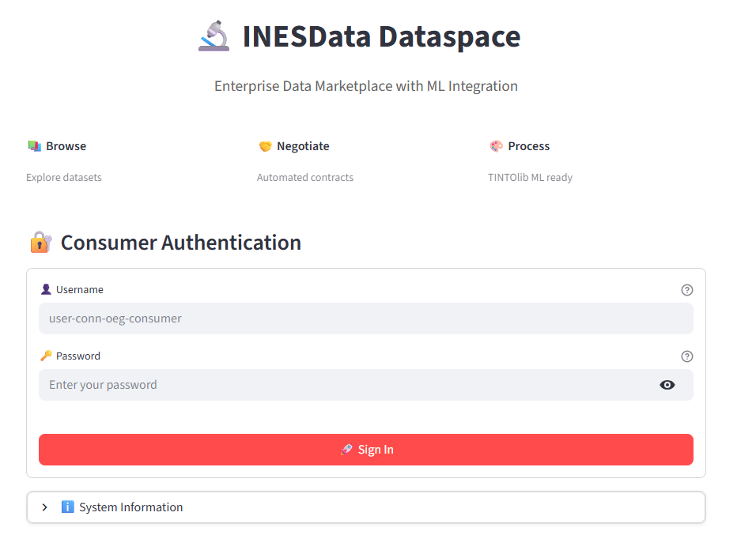
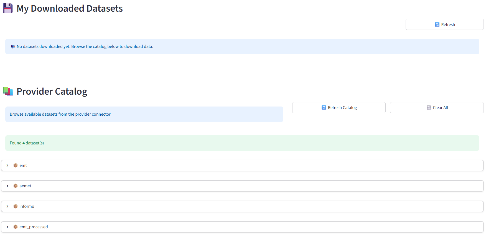
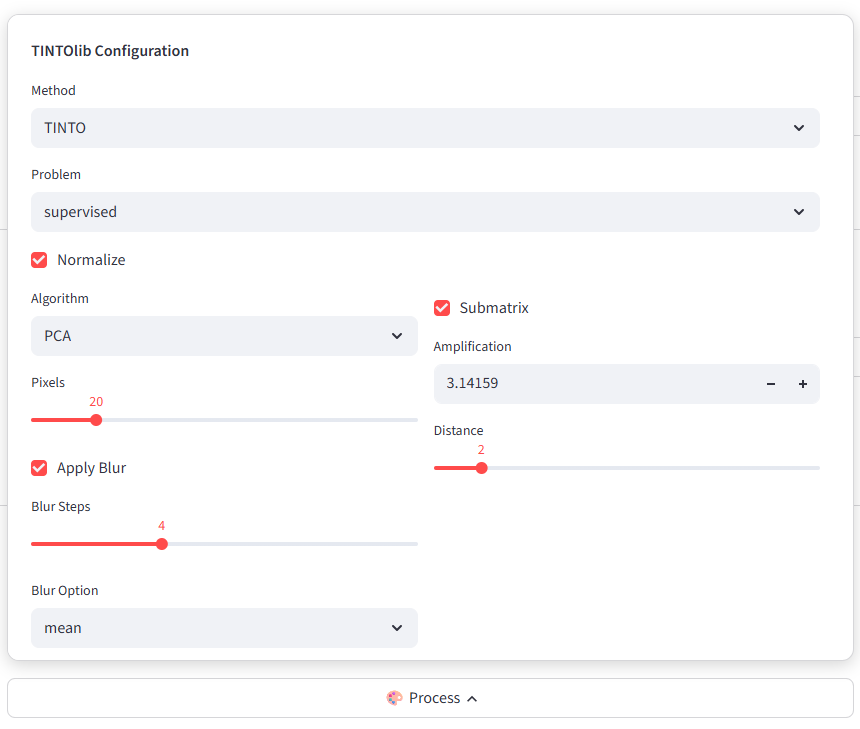

# INESData Local Deployment with AI Vision Models Integration

[](https://github.com/INESData)
[](https://www.python.org/downloads/)
[](https://streamlit.io/)
[](https://github.com/oeg-upm/TINTOlib)

A comprehensive demonstration of **INESData dataspace** deployment showcasing an AI-powered application that transforms tabular datasets into synthetic images for computer vision models using **TINTOlib**.

## 🎯 Overview

This repository demonstrates a complete dataspace ecosystem with:
- **Local deployment** of INESData components (provider and consumer connectors)
- **Streamlit application** for dataspace interaction and automated workflows
- **AI/ML integration** using TINTOlib to convert tabular data into images for vision models
- End-to-end data exchange with authentication, catalog browsing, contract negotiation, and data transfer

## 🏗️ Architecture

```
┌─────────────────────────────────────────────────────────────┐
│                    INESData Dataspace                        │
├─────────────────┬──────────────────┬────────────────────────┤
│  Provider       │   Keycloak       │   Consumer             │
│  Connector      │   Auth Server    │   Connector            │
└────────┬────────┴────────┬─────────┴───────┬────────────────┘
         │                 │                 │
         └─────────────────┼─────────────────┘
                           │
                  ┌────────▼────────┐
                  │   Streamlit     │
                  │   Application   │
                  └────────┬────────┘
                           │
                  ┌────────▼────────┐
                  │    TINTOlib     │
                  │  Image Synthesis│
                  └─────────────────┘
```

## 📦 Components

This project integrates the following INESData components:

| Component | Repository | Description |
|-----------|-----------|-------------|
| **Connector** | [inesdata-connector](https://github.com/INESData/inesdata-connector) | Core EDC-based connector for data exchange |
| **Deployment** | [inesdata-deployment](https://github.com/INESData/inesdata-deployment) | Infrastructure deployment scripts and configurations |
| **Public Portal Frontend** | [inesdata-public-portal-frontend](https://github.com/INESData/inesdata-public-portal-frontend) | Web interface for dataspace exploration |
| **Public Portal Backend** | [inesdata-public-portal-backend](https://github.com/INESData/inesdata-public-portal-backend) | Backend services for portal functionality |
| **Registration Service** | [inesdata-registration-service](https://github.com/INESData/inesdata-registration-service) | Connector registration and management |

## 💡 Visual Walkthrough: Tabular Data to Vision Models

The Streamlit application demonstrates an end-to-end AI workflow. Below is the step-by-step process captured from the application interface.

### 1. Authentication
Secure login via Keycloak using consumer connector credentials. The app manages OAuth2 tokens for all subsequent requests.


### 2. Catalog Discovery
Browse the federated catalog to discover available datasets exposed by the Provider Connector.


### 3. Contract Negotiation
View detailed metadata and negotiate usage contracts automatically. The system handles policy evaluation before access is granted.


### 4. Secure Data Transfer
Once the contract is agreed upon, the dataset (CSV) is securely transferred via EDC protocols and saved locally.


### 5. AI Image Synthesis (TINTOlib)
The tabular data is processed using **TINTOlib** to generate synthetic images. These images represent the feature space of the data, making them ready for training Convolutional Neural Networks (CNNs) or Vision Transformers. The images can then be downloaded as a zip.


---

## 🚀 Quick Start

### Prerequisites

- **Kubernetes cluster** (Minikube recommended for local deployment)
- **Docker** with Minikube tunnel running
- **kubectl** and **helm** installed
- **Python 3.10+**

### 📘 Deployment Guides

This repository includes comprehensive documentation for local deployment:

- **📄 [Instalar-Inesdata-DEV-localmente-v2.pdf](./Instalar-Inesdata-DEV-localmente-v2.pdf)** - Complete step-by-step guide for local INESData deployment
- **📝 [deployment-guide.txt](./inesdata-deployment/deployment-guide.txt)** - Quick reference with deployment commands
- **📋 [Guia_Despliegue_Local_INESData.docx](./Guia_Despliegue_Local_INESData.docx)** - Additional deployment documentation

### Deployment Steps

1. **Deploy common services** (PostgreSQL, MinIO, Keycloak, Vault)
   ```bash
   cd inesdata-deployment/common
   helm install -f values.yaml -n common --create-namespace common-services .
   ```

2. **Create dataspace and connectors**
   ```bash
   cd inesdata-deployment
   source .venv/bin/activate
   python deployer.py dataspace create <dataspace-name>
   python deployer.py connector create <connector-provider> <dataspace-name>
   python deployer.py connector create <connector-consumer> <dataspace-name>
   ```

3. **Deploy using Helm charts** (follow detailed steps in PDF guide)
   ```bash
   # Deploy registration service (step 1)
   cd dataspace/step-1
   helm install -f values.yaml -n <dataspace-name>-ds --create-namespace <dataspace-name>-dataspace-s1 .
   
   # Deploy connectors
   cd ../../connector
   helm install -f values.yaml -n <dataspace-name>-ds <connector-name> .
   ```

4. **Launch Streamlit application**
   ```bash
   cd streamlit-dataspace-app
   pip install -r requirements.txt
   streamlit run app.py
   ```

### 🐳 Using Local Docker Images

Instead of pulling images from GitHub Container Registry (`ghcr.io/inesdata/*`), you can build and use local images:

1. **Build images locally** for each component:
   ```bash
   # Build connector image
   cd inesdata-connector
   docker build -f docker/Dockerfile -t inesdata-connector:local .
   
   # Build connector interface
   cd ../inesdata-connector-interface
   docker build -f docker/Dockerfile -t inesdata-connector-interface:local .
   
   # Build registration service
   cd ../inesdata-registration-service
   docker build -f docker/Dockerfile -t inesdata-registration-service:local .
   
   # Build public portal frontend
   cd ../inesdata-public-portal-frontend
   docker build -f docker/Dockerfile -t inesdata-public-portal-frontend:local .
   ```

2. **Update Helm values** to use local images:
   - In `inesdata-deployment/connector/values.yaml.tpl`, change:
     ```yaml
     image:
       name: inesdata-connector:local
       pullPolicy: Never
     ```
   - Apply similar changes to other component values files
   
   > See deployment guides for complete instructions on local image configuration

## 💡 Use Case: Tabular Data to Vision Models

The Streamlit application demonstrates an AI workflow:

1. **Authenticate** with Keycloak using consumer connector credentials
2. **Browse** the federated catalog to discover available datasets
3. **Negotiate** contracts automatically with the provider
4. **Transfer** and download tabular datasets (CSV)
5. **Transform** data using TINTOlib into synthetic images
6. **Generate** vision-ready datasets for CNN/transformer models

### TINTOlib Integration

[TINTOlib](https://github.com/oeg-upm/TINTOlib) converts tabular data into images using various methods:
- **TINTO**: Feature-to-pixel mapping
- **IGTD**: Image Generator from Tabular Data
- **BarGraph**: Visual bar representations
- **DistanceMatrix**: Similarity-based visualizations
- And more...

This enables the use of powerful computer vision models (ResNet, Vision Transformers, etc.) on traditionally tabular datasets.

## 📁 Repository Structure

```
.
├── Instalar-Inesdata-DEV-localmente-v2.pdf  # 📄 Main deployment guide
├── Guia_Despliegue_Local_INESData.docx      # 📋 Additional documentation
├── inesdata-connector/                       # Connector source code
├── inesdata-connector-interface/             # Connector web interface
├── inesdata-deployment/                      # 🔧 Deployment scripts and configs
│   ├── deployment-guide.txt                  # Quick reference commands
│   ├── deployer.py                           # Automated deployment tool
│   ├── common/                               # Common services (DB, MinIO, etc.)
│   ├── connector/                            # Connector Helm charts
│   └── dataspace/                            # Dataspace Helm charts
├── inesdata-public-portal-frontend/          # Public portal UI
├── inesdata-registration-service/            # Registration service
└── streamlit-dataspace-app/                  # 🌟 AI Application (main showcase)
    ├── app.py                                # Main Streamlit interface
    ├── auth.py                               # Keycloak authentication
    ├── edc_client.py                         # EDC Management API client
    ├── tinto_processor.py                    # TINTOlib integration
    └── config.py                             # Configuration
```

## 🎨 Features

### Streamlit Application
- **🔐 Secure Authentication**: OAuth2/Keycloak integration
- **📊 Catalog Browser**: Explore federated datasets with rich metadata
- **🤝 Automated Negotiation**: Contract handling with policy evaluation
- **📥 Data Transfer**: EDR-based secure data download
- **🎨 Image Synthesis**: Real-time TINTOlib transformations
- **📈 Progress Tracking**: Visual feedback for async operations

### Dataspace Capabilities
- **Federated catalog** across multiple connectors
- **Policy-based access control** with contract negotiation
- **Secure data transfer** using EDC protocols
- **Keycloak authentication** for user and service accounts

## 🛠️ Configuration

Key configuration in `streamlit-dataspace-app/config.py`:

```python
KEYCLOAK_URL = "http://keycloak.dev.ed.inesdata.upm"
CONSUMER_CONNECTOR_URL = "http://conn-oeg-consumer.dev.ds.inesdata.upm"
PROVIDER_CONNECTOR_URL = "http://conn-oeg-provider.dev.ds.inesdata.upm"
```

Credentials are provided via interactive login (no hardcoded secrets).

## 📚 Documentation

### Deployment Documentation
- **📄 [Instalar-Inesdata-DEV-localmente-v2.pdf](./Instalar-Inesdata-DEV-localmente-v2.pdf)** - Complete local deployment guide
- **📝 [deployment-guide.txt](./inesdata-deployment/deployment-guide.txt)** - Command reference for dataspace/connector deployment
- **📖 [inesdata-deployment/README.md](./inesdata-deployment/README.md)** - Deployment architecture overview
- **📋 [Guia_Despliegue_Local_INESData.docx](./Guia_Despliegue_Local_INESData.docx)** - Additional deployment notes

### Application Documentation
- **🎨 [streamlit-dataspace-app/README.md](./streamlit-dataspace-app/README.md)** - Streamlit application setup and usage

### External Resources
- **🌐 [INESData GitHub Organization](https://github.com/INESData)** - Official INESData repositories
- **📚 [TINTOlib Documentation](https://github.com/oeg-upm/TINTOlib)** - Image synthesis library

## 🤝 Acknowledgments

This project builds upon the **INESData** initiative:
- **INESData Team** for the dataspace infrastructure components
- **OEG-UPM** for TINTOlib library
- **Eclipse Dataspace Components** for the underlying EDC framework

## 📄 License

This project follows the licensing of its component repositories. Please refer to individual component licenses for details.

## 🔗 Related Links

- [INESData GitHub Organization](https://github.com/INESData)
- [TINTOlib Documentation](https://github.com/oeg-upm/TINTOlib)
- [Eclipse Dataspace Components](https://github.com/eclipse-edc/Connector)

---

**Note**: This is a demonstration environment for local development and testing. For production deployments, refer to the official INESData deployment documentation.

# Disclaimer

Este trabajo ha recibido financiación del proyecto INESData (Infraestructura para la INvestigación de ESpacios de DAtos distribuidos en UPM), un proyecto financiado en el contexto de la convocatoria UNICO I+D CLOUD del Ministerio para la Transformación Digital y de la Función Pública en el marco del PRTR financiado por Unión Europea (NextGenerationEU)
