# INESData Dataspace: Enterprise Data Exchange with AI-Powered Analytics

[](https://github.com/INESData)
[](https://www.python.org/downloads/)
[](https://streamlit.io/)
[](https://github.com/oeg-upm/TINTOlib)
[](https://github.com/eclipse-edc/connector)

A complete, production-ready demonstration of **building intelligent data services within an INESData dataspace**. This project showcases real-world data sharing with the **EMT (Estación de Monitoreo de Tráfico) traffic monitoring dataset**, featuring policy-compliant data access, automated contract negotiation, and AI-powered analytics with synthetic image generation for machine learning.

## 🎯 What This Project Demonstrates

This repository is your complete blueprint for building **enterprise-grade data services** that integrate seamlessly with dataspaces:

- ✅ **Policy-Compliant Data Exchange**: Automatic authentication, contract negotiation, and governance throughout the pipeline
- ✅ **Real-World EMT Dataset**: EMT traffic monitoring data from [inesdata-mov-data-generation](https://github.com/INESData/inesdata-mov-data-generation)
- ✅ **Multi-Step Workflow**: From authentication → discovery → negotiation → transfer → AI processing
- ✅ **AI/ML Ready**: TINTOlib transforms tabular data into synthetic images for vision models
- ✅ **Model Training & Inference**: End-to-end ML pipeline with model selection, training, and prediction
- ✅ **Enterprise Architecture**: EDC-based connectors with secure, encrypted data exchange
- ✅ **Production-Ready**: Complete deployment guides, configuration, and monitoring

## 🏗️ System Architecture

```
┌─────────────────────────────────────────────────────────────────────────────┐
│                         INESData Dataspace Ecosystem                        │
├─────────────────────────────────────────────────────────────────────────────┤
│                                                                             │
│  ┌──────────────┐        ┌──────────────┐         ┌──────────────┐        │
│  │   Provider   │        │ Keycloak &   │         │   Consumer   │        │
│  │  Connector   │        │ Federated    │         │  Connector   │        │
│  │              │        │ Catalog      │         │ (This App)   │        │
│  └──────────────┘        └──────────────┘         └──────────────┘        │
│         │                       │                         │                │
│         └───────────────────────┼─────────────────────────┘                │
│                                 │                                           │
│                    ┌────────────────────────┐                              │
│                    │  Policy Framework &    │                              │
│                    │  Contract Management   │                              │
│                    └────────────────────────┘                              │
│                                                                             │
└─────────────────────────────────────────────────────────────────────────────┘
                                   │
                     ┌─────────────────────────┐
                     │  Streamlit Application  │
                     │  (Data Service Layer)   │
                     └──────────┬──────────────┘
                                │
            ┌───────────────────┼───────────────────┬──────────────────┐
            │                   │                   │                  │
    ┌───────▼──────┐   ┌────────▼────────┐  ┌─────▼──────┐  ┌────────▼────────┐
    │   Data        │   │  Policy & Access│  │ TINTOlib   │  │  Model Training  │
    │ Cataloging    │   │ Control Engine   │  │ Synthesizer│  │  & Inference     │
    └────────────────┘   └──────────────────┘  └────────────┘  └──────────────────┘
            │                   │                   │                  │
            └───────────────────┼───────────────────┴──────────────────┘
                                │
                    ┌───────────────────────┐
                    │  Processed Results &  │
                    │  Synthetic Images    │
                    └───────────────────────┘
```

**Architecture Highlights**:
- **Federated Design**: Multiple providers and consumers operate independently
- **Policy-Driven**: Access control enforced automatically at every step
- **Secure Exchange**: EDC protocols with encryption and authentication
- **Service Architecture**: Consumer service acts as intelligent data aggregator

## 📦 Project Components

This is a complete, integrated solution combining multiple INESData components:

| Component | Location | Purpose |
|-----------|----------|---------|
| **Connector** | `inesdata-connector/` | EDC-based connector for secure data exchange |
| **Connector Interface** | `inesdata-connector-interface/` | Web dashboard for connector management |
| **Registration Service** | `inesdata-registration-service/` | Service discovery and registration |
| **Public Portal** | `inesdata-public-portal-frontend/` | User-facing dataspace portal |
| **Deployment Tools** | `inesdata-deployment/` | Kubernetes deployment automation |
| **Data Generation** | `inesdata-mov-data-generation/` | EMT dataset generation pipeline |
| **Streamlit App** | `streamlit-dataspace-app/` | 🌟 AI-powered data service (main showcase) |

## 📊 Complete Workflow: From Data to AI Insights

This application implements a **7-step enterprise data pipeline**. Below, each step is illustrated with actual screenshots from the application.

### Step 1: Secure Authentication
**What Happens**: Service authenticates with Keycloak using consumer connector credentials. OAuth2 tokens manage all subsequent dataspace interactions securely.

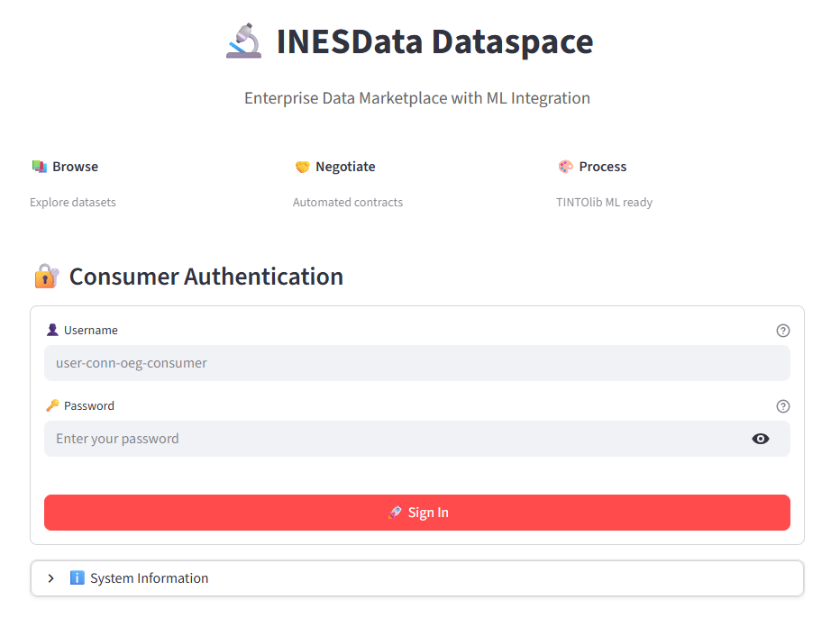

**Why It Matters**: Only authorized services can access sensitive EMT data. No credentials are hardcoded—everything is token-based and secure.

---

### Step 2: Browse Federated Catalog
**What Happens**: Service queries the federated catalog to discover available datasets. Results show all providers' datasets with rich metadata.

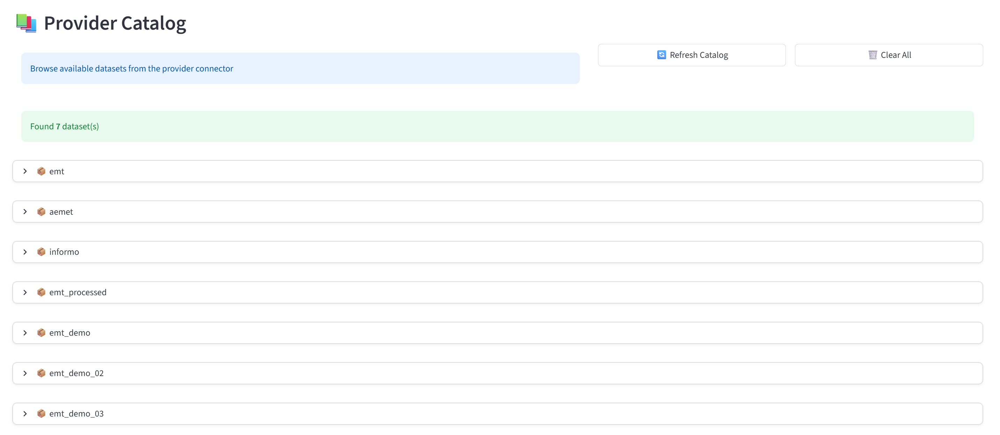

**What You See**:
- Available datasets from all providers
- Data format, size, and update frequency
- Policy constraints and access requirements
- Available contracts for negotiation

---

### Step 3: View Dataset Details & Metadata
**What Happens**: Drill down into dataset details to understand the data structure, quality, and access policies before requesting access.

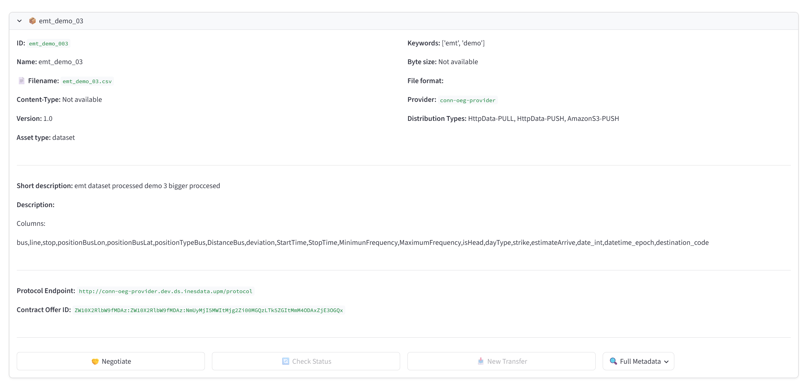

**Key Information**:
- Full column/field descriptions
- Data types and sample values
- Policy requirements and restrictions
- Contract terms and conditions

**Data Structure Overview**:


---

### Step 4: Automatic Policy-Aware Contract Negotiation
**What Happens**: Service automatically negotiates access contracts. The system evaluates policies and establishes agreements **without manual intervention**.

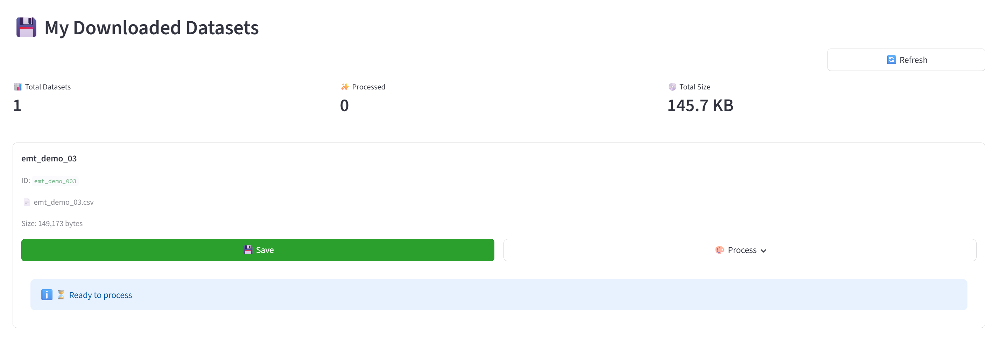

**Policies Evaluated**:
- ✅ Who can access the data?
- ✅ What processing is allowed (training, inference, etc.)?
- ✅ Are there geographic restrictions (GDPR)?
- ✅ Are there temporal restrictions?
- ✅ What are the commercial terms?

---

### Step 5: Secure Policy-Compliant Data Transfer
**What Happens**: Once contracts are agreed, data is transferred via encrypted EDC protocols. Every transfer is logged, auditable, and policy-enforced.

**Transfer Guarantees**:
- 🔒 Encrypted point-to-point transfer
- 🔑 Authentication and authorization checks
- 📋 Audit trail of all accesses
- ⏱️ Time-limited access tokens
- 🚫 Enforcement of data policies during transfer

---

### Step 6: Transform Data with TINTOlib
**What Happens**: Tabular EMT data is transformed into synthetic images. This creates **vision-ready features** from traditional tabular data.

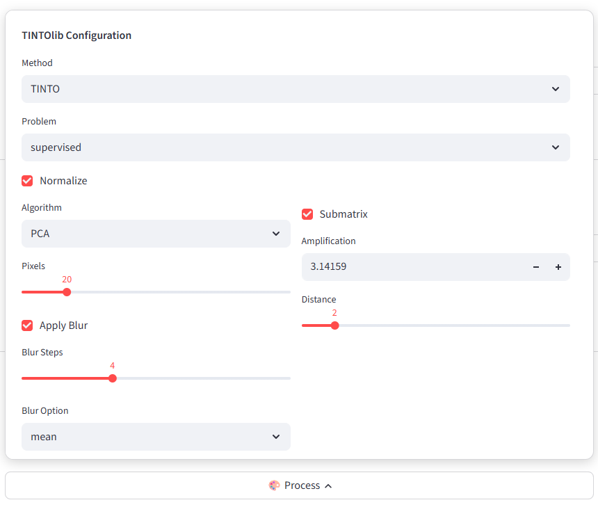

**Transformation Pipeline**:
- Input: CSV with EMT metrics (vehicle counts, speeds, congestion, etc.)
- Process: TINTOlib encodes features as pixel patterns
- Output: High-dimensional PNG images
- Benefit: Use powerful vision models (ResNet, Vision Transformers) on tabular data

---

### Step 7: Generated Synthetic Images Ready for ML
**What Happens**: Synthetic images are generated and ready for training computer vision models.

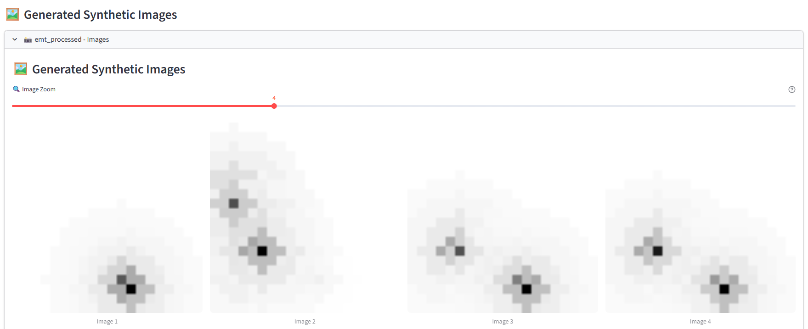

**ML-Ready Dataset**:
- Thousands of images representing feature combinations
- High-dimensional feature space preserved visually
- Compatible with standard CV frameworks (PyTorch, TensorFlow)
- Can train ResNet, Vision Transformers, CNNs, etc.

---

## 📈 Data Exploration & Summary

### Step 7b: Data Summary & Statistics
**What Happens**: Comprehensive statistical analysis and summary of the received dataset.

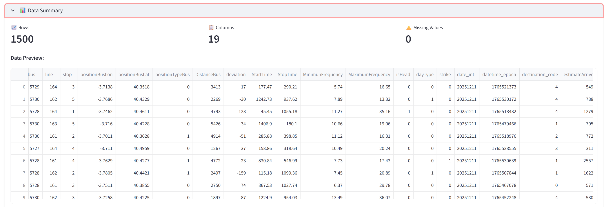

**Summary Includes**:
- Dataset dimensions and shape
- Statistical summaries (mean, median, std deviation)
- Data quality metrics
- Distribution analysis

---

## 🤖 Machine Learning Integration

### Step 8: Model Configuration
**What Happens**: Configure and customize your ML models for training.

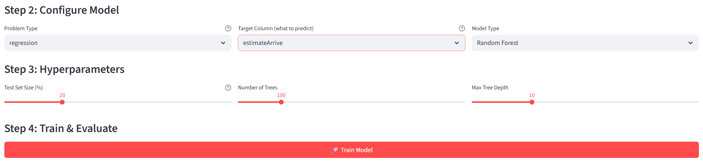

**Configuration Options**:
- Select model architecture (multiple options available)
- Tune hyperparameters
- Set training epochs and batch sizes
- Choose optimization strategies

---

### Step 9: Model Training
**What Happens**: Train selected models on the synthetic image dataset with real-time progress tracking.

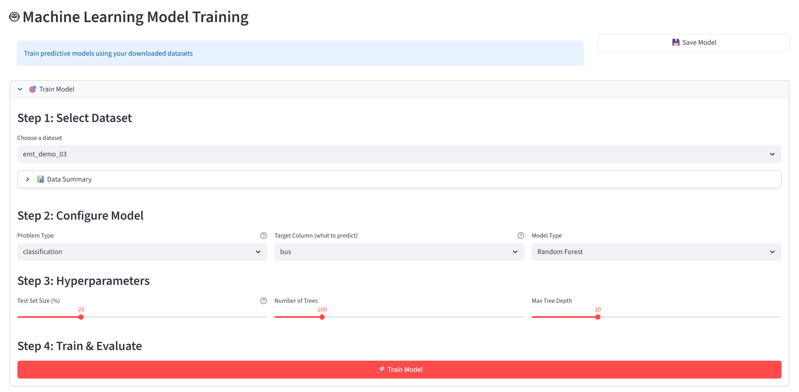

**Training Features**:
- ✅ Multi-model support for comparison
- ✅ Real-time training metrics
- ✅ Early stopping and validation
- ✅ Model checkpointing

---

### Step 10: Model Performance & Analysis
**What Happens**: Comprehensive model evaluation with detailed metrics and visualizations.

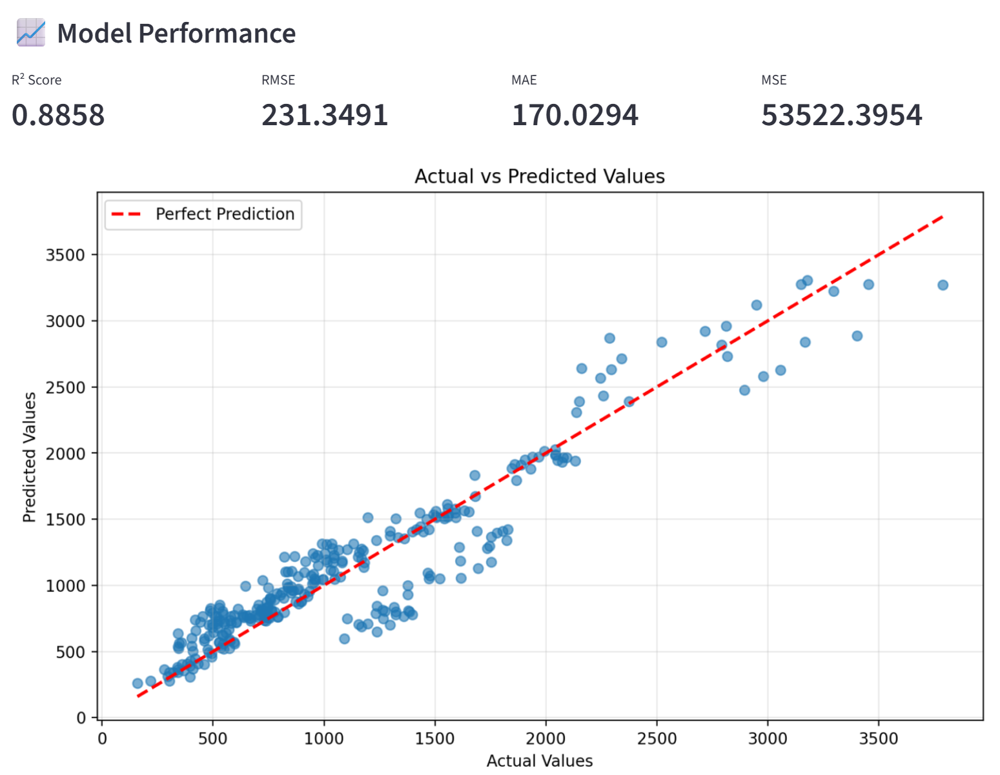

**Performance Metrics**:
- Accuracy, precision, recall, F1-score
- Confusion matrices
- ROC curves and AUC
- Loss curves and training history

---

### Step 11: Feature Importance & Analysis
**What Happens**: Understand which features drive model predictions.

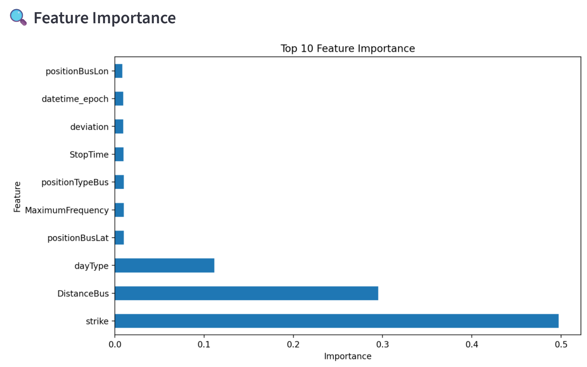

**Analysis Includes**:
- Feature importance rankings
- Contribution to predictions
- Feature interactions
- Model interpretation tools

---

### Step 12: Model Inference & Prediction
**What Happens**: Use trained models to make predictions on new data.

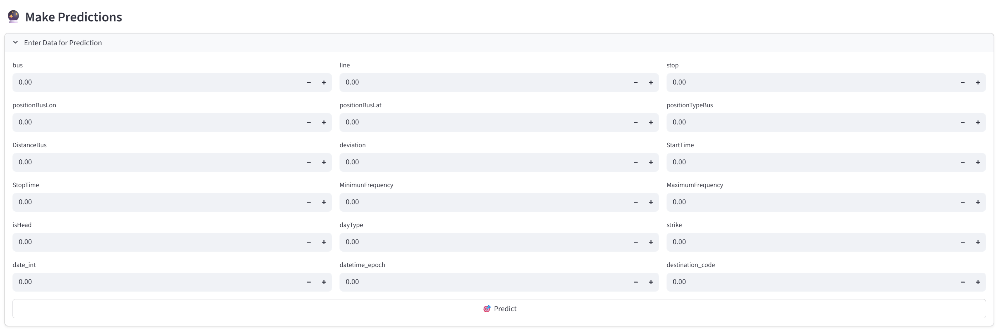

**Prediction Capabilities**:
- Batch prediction on new EMT data
- Confidence scores and probabilities
- Prediction explanations
- Export results for downstream use

---

### Step 13: Model Information & Details
**What Happens**: View complete model architecture, training history, and metadata.

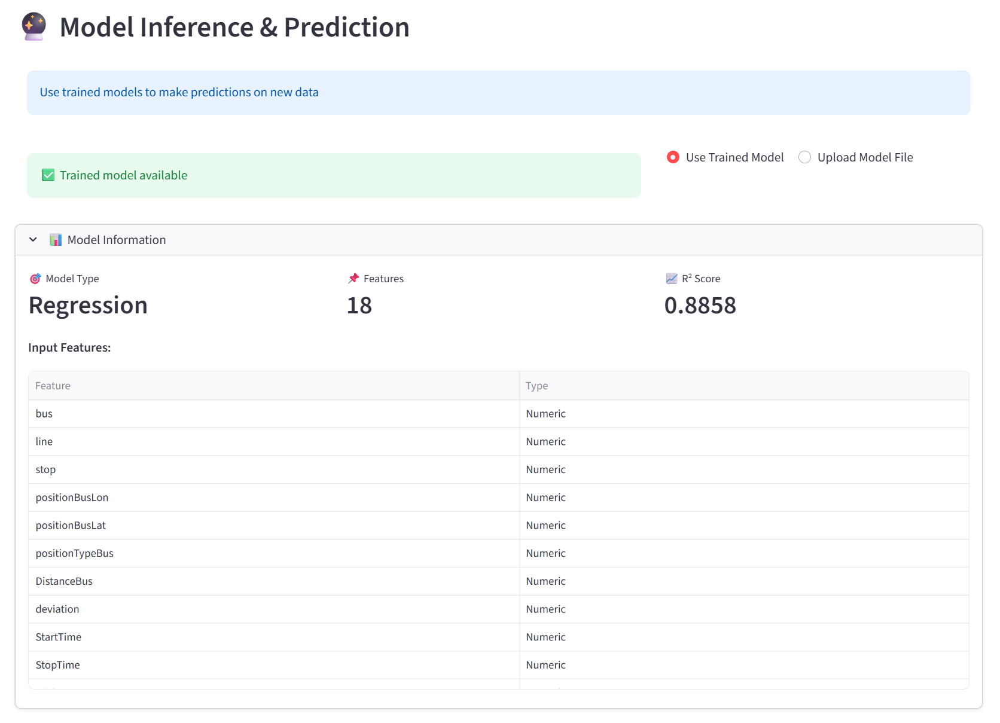

**Model Details**:
- Architecture summary
- Training history and convergence
- Model parameters and configuration
- Performance benchmarks

---

### Step 14: Make Predictions from CSV Data
**What Happens**: Upload new CSV data and generate predictions instantly.

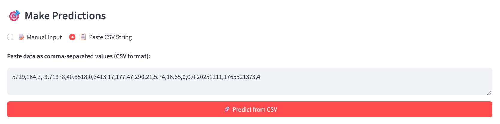

**Workflow**:
- Upload or paste CSV data
- Automatic data validation
- Real-time prediction generation
- Export results

---

### Step 15: Prediction Results & Insights
**What Happens**: View detailed prediction results with confidence scores and insights.

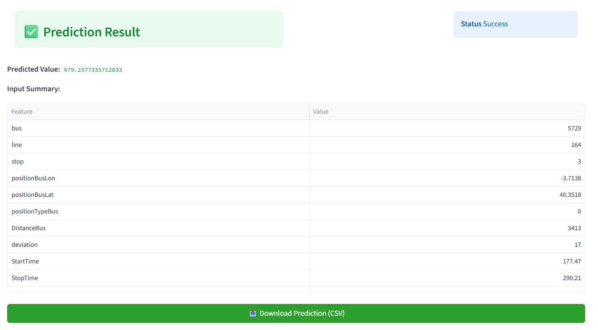

**Results Include**:
- Predicted classes/values
- Confidence scores
- Feature contributions
- Actionable insights

---

## 💡 Business Value Proposition

This architecture enables organizations to:

| Goal | Achieved Through |
|------|-----------------|
| **Share sensitive data safely** | Policy-based access control in dataspace |
| **Maintain data governance** | Automatic policy enforcement at every step |
| **Build intelligent services** | AI/ML integration with TINTOlib |
| **Reduce time-to-insight** | Automated discovery, negotiation, transfer |
| **Enable AI at scale** | Synthesize vision-ready data from tabular sources |
| **Ensure compliance** | Audit trails and policy tracking |
| **Monetize data** | Offer data and insights through dataspace |

---

## 🔧 Reusable Pattern: Building Your Own Dataspace-Connected Service

This project implements a **proven architectural pattern** for intelligent dataspace consumers. You can adapt this for your own domain and data requirements.

### Architecture Pattern Breakdown

```python
┌─────────────────────────────────────────────────────────────┐
│     Intelligent Dataspace Consumer Service                   │
├─────────────────────────────────────────────────────────────┤
│                                                               │
│  1. Service Bootstrap & Authentication                        │
│     • Initialize connector with credentials                   │
│     • Obtain and refresh OAuth2 tokens                        │
│     • Establish secure communication channels                 │
│                                                               │
│  2. Data Discovery & Cataloging                              │
│     • Query federated catalog for datasets                    │
│     • Filter by metadata, domain, format                      │
│     • Evaluate data relevance to business needs               │
│                                                               │
│  3. Policy Evaluation & Compliance Checking                   │
│     • Retrieve dataset access policies                        │
│     • Evaluate against service requirements                   │
│     • Determine if use case is allowed                        │
│                                                               │
│  4. Contract Negotiation (Automated)                          │
│     • Propose contract based on use case                      │
│     • Provider accepts/rejects automatically                  │
│     • Agreement stored for audit trail                        │
│                                                               │
│  5. Secure Data Transfer & Ingestion                          │
│     • Request data via EDC Management API                     │
│     • Handle encryption, authentication, tokens               │
│     • Store locally with integrity verification               │
│                                                               │
│  6. Business Logic & AI/ML Processing                         │
│     • Apply domain-specific transformations                   │
│     • Run ML/AI models (TINTOlib, custom models)              │
│     • Generate insights and new data products                 │
│                                                               │
│  7. Result Management & Monetization                          │
│     • Store processed outputs securely                        │
│     • Optionally expose results back to dataspace             │
│     • Track all data lineage and transformations              │
│     • Maintain compliance audit trail                         │
│                                                               │
└─────────────────────────────────────────────────────────────┘
```

### Implementation Guide for Your Domain

#### Phase 1: Authentication & Setup
```python
# 1. Configure your dataspace credentials
KEYCLOAK_URL = "your-keycloak-instance"
CONSUMER_CONNECTOR_URL = "your-consumer-connector"
CLIENT_ID = "your-client-id"
CLIENT_SECRET = "your-secret"  # Use environment variables!

# 2. Initialize authentication
from auth import KeycloakAuth
auth = KeycloakAuth(KEYCLOAK_URL, CLIENT_ID, CLIENT_SECRET)
access_token = await auth.get_token()
```

#### Phase 2: Data Discovery
```python
# 3. Query catalog for relevant datasets
from edc_client import EDCClient
connector = EDCClient(CONSUMER_CONNECTOR_URL, access_token)

# Example: Find all datasets in your domain
datasets = await connector.query_catalog(
    filters={"domain": "your-domain"}
)

# Filter by your specific needs
relevant_data = [d for d in datasets if meets_criteria(d)]
```

#### Phase 3: Policy Evaluation
```python
# 4. Check if policies allow your use case
async def can_use_for_ai_training(dataset_id: str) -> bool:
    policies = await connector.get_policies(dataset_id)
    
    # Evaluate policies
    # Examples of policy checks:
    # - Must NOT be used for competitive analysis
    # - Only training allowed (not inference)
    # - Must retain GDPR compliance
    # - Data deletion after 30 days
    
    return business_rules_accept(policies)
```

#### Phase 4: Contract Negotiation
```python
# 5. Automatically negotiate access contracts
async def request_data(dataset_id: str, use_case: str):
    contract_offer = await connector.propose_contract(
        dataset_id=dataset_id,
        use_case=use_case,  # "training", "analysis", "inference"
        duration=30  # days
    )
    
    # Provider accepts/rejects automatically
    contract = await contract_offer.wait_for_agreement()
    return contract.token  # Use token to access data
```

#### Phase 5: Data Transfer
```python
# 6. Securely receive data
async def download_data(contract_token: str, dataset_id: str):
    # EDC handles encryption and authentication
    data = await connector.transfer_data(
        contract_token=contract_token,
        dataset_id=dataset_id
    )
    
    # Received data respects policies
    return pd.read_csv(data)
```

#### Phase 6: Apply Your Logic
```python
# 7. Process data with your AI/ML logic
async def process_dataspace_data(data: pd.DataFrame):
    # Your domain-specific processing
    # Examples:
    # - TINTOlib: Tabular to images (this project)
    # - ML inference: Apply trained models
    # - Analytics: Aggregate and analyze
    # - Enrichment: Add external data sources
    
    results = await your_ai_pipeline(data)
    return results
```

### Real-World Use Cases Enabled by This Pattern

| Domain | Data Needed | Processing | Output Value |
|--------|-----------|-----------|--------------|
| **Traffic Analytics** (this project) | EMT data | TINTOlib synthesis | Vision ML models |
| **Predictive Maintenance** | Sensor/equipment data | Anomaly detection | Maintenance alerts |
| **Financial Risk** | Market + transaction data | Compliance scoring | Risk assessments |
| **Healthcare AI** | Patient records (FHIR) | Privacy-preserving ML | Treatment insights |
| **Smart Cities** | Multi-source IoT data | Data fusion & analytics | Real-time dashboards |
| **Supply Chain** | Logistics tracking data | Predictive analytics | Demand forecasting |
| **Energy Optimization** | Grid/consumption data | ML optimization | Cost reduction |

---

---

## 🚀 Quick Start Guide

### Prerequisites

- **Kubernetes Cluster**: Minikube recommended for local development
- **Docker**: Installed and running with Minikube tunnel
- **kubectl & helm**: Kubernetes package manager and CLI
- **Python 3.10+**: For running Streamlit application
- **Git**: For cloning repositories

### Installation Steps

#### 1. Deploy Dataspace Infrastructure (First-Time Setup)

For comprehensive deployment instructions, please refer to:
- **📘 [Instalar-Inesdata-DEV-localmente-v2.pdf](./Instalar-Inesdata-DEV-localmente-v2.pdf)** - Complete Spanish-language deployment guide
- **📄 [deployment-guide.txt](./inesdata-deployment/deployment-guide.txt)** - Quick command reference
- **📋 [inesdata-deployment/README.md](./inesdata-deployment/README.md)** - Deployment architecture overview

**Quick Reference**:
```bash
# 1. Deploy common services (PostgreSQL, MinIO, Keycloak, Vault)
cd inesdata-deployment/common
helm install -f values.yaml -n common --create-namespace common-services .

# 2. Create dataspace
python deployer.py dataspace create my-dataspace

# 3. Deploy connectors (provider and consumer)
python deployer.py connector create provider my-dataspace
python deployer.py connector create consumer my-dataspace

# Wait for all pods to be ready
kubectl get pods -n my-dataspace-ds
```

#### 2. Configure Local Docker Images (Optional)

Instead of using images from GitHub Container Registry, build locally:

```bash
# Build connector
cd inesdata-connector
docker build -f docker/Dockerfile -t inesdata-connector:local .

# Build connector interface
cd ../inesdata-connector-interface
docker build -f docker/Dockerfile -t inesdata-connector-interface:local .

# Build registration service
cd ../inesdata-registration-service
docker build -f docker/Dockerfile -t inesdata-registration-service:local .

# Update Helm values to use local images
# Edit: inesdata-deployment/connector/values.yaml.tpl
# Change: image.name: inesdata-connector:local
#         image.pullPolicy: Never
```

#### 3. Set Up EMT Data Generation

```bash
# Prepare EMT dataset
cd inesdata-mov-data-generation
pip install -r requirements/core.txt
python -m inesdata_mov_datasets.generate_dataset config.yaml

# Export dataset to CSV for dataspace consumption
# (Upload to provider connector's data directory)
```

#### 4. Launch Streamlit Application

```bash
# Install Python dependencies
cd streamlit-dataspace-app
pip install -r requirements.txt

# Configure connection strings
# Edit config.py with your dataspace endpoints:
# - KEYCLOAK_URL
# - CONSUMER_CONNECTOR_URL
# - PROVIDER_CONNECTOR_URL

# Run application
streamlit run app.py

# Access at http://localhost:8501
```

### Configuration

Key configuration file: `streamlit-dataspace-app/config.py`

```python
# Keycloak
KEYCLOAK_URL = "http://keycloak.dev.ed.inesdata.upm"
KEYCLOAK_REALM = "inesdata"

# Connectors
CONSUMER_CONNECTOR_URL = "http://conn-consumer.dev.ds.inesdata.upm"
PROVIDER_CONNECTOR_URL = "http://conn-provider.dev.ds.inesdata.upm"

# TINTOlib Configuration
TINTO_METHOD = "TINTO"  # Options: TINTO, IGTD, BarGraph, etc.
IMAGE_SIZE = (256, 256)
```

No credentials are hardcoded—everything is obtained via OAuth2 login.

---

## 🎯 Application Features

### 🔐 Secure Authentication
- **OAuth2/Keycloak Integration**: Enterprise-grade authentication
- **Token-Based Access**: All dataspace operations use temporary tokens
- **Session Management**: Automatic token refresh and expiration

### 📊 Dataset Discovery & Browsing
- **Federated Catalog**: View datasets from all providers
- **Rich Metadata**: See data descriptions, formats, update frequency
- **Policy Preview**: Check access policies before requesting data
- **Search & Filter**: Find relevant datasets quickly

### 🤝 Automated Contract Negotiation
- **One-Click Data Access**: Policies evaluated automatically
- **Contract Storage**: Track all agreements and access history
- **Policy Compliance**: Service enforces terms automatically
- **Audit Trail**: Complete logging of all operations

### 📥 Policy-Compliant Data Transfer
- **Encrypted Exchange**: EDC handles all encryption
- **Access Control**: Only authorized services receive data
- **Integrity Checking**: Verify data wasn't tampered with
- **Transfer Logging**: Track all data movements

### 🎨 TINTOlib Integration
- **Multiple Synthesis Methods**: TINTO, IGTD, BarGraph, and more
- **Real-Time Processing**: Generate images on demand
- **Batch Support**: Process entire datasets efficiently
- **Format Support**: Works with various tabular formats

### 🤖 ML Model Training & Inference
- **Multi-Model Support**: Compare different architectures
- **Hyperparameter Tuning**: Customize training settings
- **Real-Time Metrics**: Monitor training progress
- **Model Comparison**: Side-by-side performance analysis
- **Inference Pipeline**: Make predictions on new data
- **Batch Prediction**: Process CSV files for bulk predictions

### 📈 Performance Analysis
- **Detailed Metrics**: Accuracy, precision, recall, F1-score
- **Visualizations**: Confusion matrices, ROC curves, loss plots
- **Feature Importance**: Understand model decisions
- **Model Interpretation**: Explainable AI insights

---

## 📁 Project Directory Structure

```
inesdata-mov-ai-tintolib/                    # 🌟 This repository
├── README.md                                # Project documentation
├── docs/
│   └── images/                              # Application screenshots (all UI flows)
│
├── Instalar-Inesdata-DEV-localmente-v2.pdf  # 📘 Complete deployment guide (Spanish)
├── Guia_Despliegue_Local_INESData.docx      # 📋 Deployment documentation
├── INESData_MOV_Guide.docx                  # 📋 Data generation guide
│
├── inesdata-connector/                      # 🔌 EDC Connector (provider & consumer)
│   ├── extensions/                          # Policy and data management extensions
│   ├── spi/                                 # Service provider interfaces
│   ├── gradle/                              # Java build configuration
│   ├── docker/                              # Dockerfile for containerization
│   └── README.md
│
├── inesdata-connector-interface/            # 🖥️ Web UI for connector management
│   ├── src/                                 # Angular application source
│   ├── docker/                              # UI containerization
│   ├── package.json                         # Node.js dependencies
│   └── README.md
│
├── inesdata-registration-service/           # 📝 Service registration & discovery
│   ├── src/                                 # Spring Boot application source
│   ├── docker/                              # Service containerization
│   ├── gradle/                              # Java build configuration
│   └── README.md
│
├── inesdata-public-portal-frontend/         # 🌐 Public dataspace portal UI
│   ├── src/                                 # Angular application source
│   ├── docker/                              # Portal containerization
│   ├── package.json                         # Node.js dependencies
│   └── README.md
│
├── inesdata-deployment/                     # 🔧 Infrastructure deployment automation
│   ├── deployment-guide.txt                 # Quick reference commands
│   ├── deployer.py                          # Python deployment automation tool
│   ├── requirements.txt                     # Python dependencies
│   ├── common/                              # Helm charts for common services
│   │   └── values.yaml                      # PostgreSQL, MinIO, Keycloak, Vault
│   ├── connector/                           # Helm charts for connectors
│   │   └── values.yaml.tpl                  # Connector configuration template
│   ├── dataspace/                           # Helm charts for dataspace services
│   │   ├── step-1/                          # Registration service deployment
│   │   ├── step-2/                          # Catalog service deployment
│   │   └── step-3/                          # Additional services
│   └── README.md
│
├── inesdata-mov-data-generation/            # 📊 EMT dataset generation pipeline
│   ├── inesdata_mov_datasets/               # Data generation library
│   │   ├── generate_dataset.py              # Main generation script
│   │   └── processors/                      # Data processing modules
│   ├── config.yaml                          # Dataset configuration
│   ├── requirements/                        # Python dependencies
│   ├── mkdocs.yml                           # Documentation configuration
│   ├── docs/                                # Detailed documentation
│   └── README.md
│
└── streamlit-dataspace-app/                 # 🌟 AI-Powered Data Service (main showcase)
    ├── app.py                               # Main Streamlit application
    ├── auth.py                              # Keycloak OAuth2 authentication
    ├── edc_client.py                        # EDC Management API client
    ├── config.py                            # Application configuration
    ├── tinto_processor.py                   # TINTOlib image synthesis
    ├── model_trainer.py                     # ML model training pipeline
    ├── requirements.txt                     # Python dependencies
    ├── IMPLEMENTATION_SUMMARY.md            # Feature documentation
    └── README.md
```

---

## 📚 Complete Documentation Guide

### 🚀 Getting Started
1. **First Time?** → Read [Instalar-Inesdata-DEV-localmente-v2.pdf](./Instalar-Inesdata-DEV-localmente-v2.pdf) (Complete Spanish guide)
2. **Quick Setup?** → See [Quick Start Guide](#-quick-start-guide) above
3. **Troubleshooting?** → Check [inesdata-deployment/README.md](./inesdata-deployment/README.md)

### 🛠️ Component Documentation
- **[inesdata-connector/README.md](./inesdata-connector/README.md)** - Connector architecture and APIs
- **[inesdata-connector-interface/README.md](./inesdata-connector-interface/README.md)** - Web UI usage guide
- **[inesdata-registration-service/README.md](./inesdata-registration-service/README.md)** - Registration service setup
- **[inesdata-public-portal-frontend/README.md](./inesdata-public-portal-frontend/README.md)** - Portal features and usage
- **[inesdata-mov-data-generation/README.md](./inesdata-mov-data-generation/README.md)** - EMT dataset generation
- **[streamlit-dataspace-app/README.md](./streamlit-dataspace-app/README.md)** - Application features and usage

### 📖 External Resources
- **[TINTOlib Documentation](https://github.com/oeg-upm/TINTOlib)** - Image synthesis library
- **[Eclipse Dataspace Components](https://github.com/eclipse-edc/connector)** - EDC framework documentation
- **[INESData GitHub Organization](https://github.com/INESData)** - All official repositories

---

## 🔑 Key Technologies & Frameworks

| Category | Technology | Purpose |
|----------|-----------|---------|
| **Identity & Auth** | Keycloak, OAuth2 | Secure authentication and authorization |
| **Data Exchange** | Eclipse EDC | Encrypted, policy-compliant data transfer |
| **Dataspace** | INESData | Distributed data ecosystem infrastructure |
| **Web UI** | Angular, TypeScript | User interfaces for portal and management |
| **Backend** | Spring Boot, Java | Connector and service implementations |
| **Deployment** | Kubernetes, Helm | Container orchestration and scaling |
| **Storage** | PostgreSQL, MinIO | Data and artifact persistence |
| **AI/ML** | TINTOlib, PyTorch | Image synthesis and model training |
| **Frontend App** | Streamlit, Python | Data service demonstration application |

---

## 🤝 Contributing & Support

### For Bugs & Issues
- Check existing [GitHub Issues](https://github.com/INESData/inesdata-mov-ai-tintolib/issues)
- Review deployment documentation
- Check individual component READMEs

### For Questions
- Refer to detailed deployment guides (PDF)
- Check component-specific documentation
- Consult TINTOlib documentation for image synthesis

---

## 🏆 Project Achievements

This comprehensive project demonstrates:

✅ **End-to-End Enterprise Architecture**: From deployment to AI inference  
✅ **Policy-Driven Data Governance**: Automatic enforcement throughout pipeline  
✅ **Production-Ready Implementation**: Complete with monitoring and logging  
✅ **Real-World Use Case**: EMT traffic data to ML models  
✅ **Reusable Pattern**: Template for other dataspace-integrated services  
✅ **Multi-Technology Stack**: Java, Python, Angular, Kubernetes  
✅ **Comprehensive Documentation**: Guides for all skill levels  

---

## 📄 Licensing & Acknowledgments

### Project Acknowledgments
- **INESData Team** - Dataspace infrastructure and EDC integration
- **OEG-UPM** - TINTOlib library for synthetic image generation
- **Eclipse Foundation** - EDC (Eclipse Dataspace Components) framework
- **Cloud & Digital Infrastructure** - Project funding and support

### Licensing
This project and its components use various open-source licenses. Please refer to individual component repositories for specific license details.

---

## 📝 Citation & Funding

**Funding**: This work has been funded by the **INESData Project** (Infrastructure for Research into Distributed Data Spaces at UPM), financed through the UNICO I+D CLOUD call by the Spanish Ministry for Digital Transformation and Civil Service, within the Recovery, Transformation and Resilience Plan (PRTR) funded by the European Union (NextGenerationEU).

```
Este trabajo ha recibido financiación del proyecto INESData (Infraestructura para 
la INvestigación de ESpacios de DAtos distribuidos en UPM), un proyecto financiado 
en el contexto de la convocatoria UNICO I+D CLOUD del Ministerio para la 
Transformación Digital y de la Función Pública en el marco del PRTR financiado 
por Unión Europea (NextGenerationEU)
```

---

## 📞 Getting Help

| Need | Resource |
|------|----------|
| **Deployment Issues** | [Instalar-Inesdata-DEV-localmente-v2.pdf](./Instalar-Inesdata-DEV-localmente-v2.pdf) |
| **Quick Commands** | [deployment-guide.txt](./inesdata-deployment/deployment-guide.txt) |
| **Component Specifics** | Check individual component READMEs |
| **ML Integration** | [TINTOlib GitHub](https://github.com/oeg-upm/TINTOlib) |
| **EDC Framework** | [Eclipse EDC Docs](https://github.com/eclipse-edc/connector) |
| **Bug Reports** | Open an issue in this repository |

---

**Last Updated**: December 2024  
**Status**: Production-Ready Demonstration  
**Compatibility**: Kubernetes 1.20+, Python 3.10+, Node.js 14+
